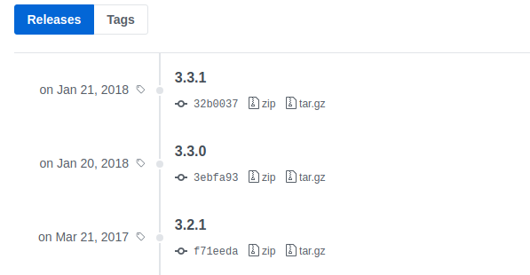

## Web フロントエンドを<br>頑張りたい人と<br>頑張りたくない人のための話

@arayaryoma

2019-01-20 #wakate2019w

---

### 自己紹介

 <!-- .element height="200px"-->
 <!-- .element height="200px" style="border-radius: 50%;" -->

- <i class="fas fa-user"></i> あらや/阿部凌磨
- <i class="fas fa-building"></i> 合同会社ヘマタイト/個人事業主
- <i class="fab fa-twitter"></i> [@arayaryoma](https://twitter.com/arayaryoma)
- <i class="fas fa-laptop"></i> HTML/CSS/JavaScript/TypeScript/Go
- <i class="fab fa-js-square"></i> Angular/React/ReactNative/Vue/Node.js

---

##### 情報科学若手の会の参加履歴

- 冬の陣 2018
  <br><br><br>

##### 情報科学若手の会に参加しようとした履歴 <!-- .element: class="fragment" data-fragment-index="1" -->

- 2016 存在を知った <!-- .element: class="fragment" data-fragment-index="1" -->
- 2017 予定が合わなかった<!-- .element: class="fragment" data-fragment-index="1" -->
- 2018 迷ってて気づいたら募集期間終わってた<!-- .element: class="fragment" data-fragment-index="1" -->
- 2019 行きたい<!-- .element: class="fragment" data-fragment-index="1" -->

---

##### 免責事項

- 発表の内容は個人の見解です。所属する組織とは関係がありません
- あまり発表慣れしてないです。聞き取れなかったら都度教えてください
- 発表者は Internet Explorer にあまりいい感情を持っていません。Microsoft は好きです

---

### 話すこと

---

##### フロントエンド頑張りたくない人向け

_「個人/OSS の Web サイトを作りたいけど、フロントエンドのカオスに首を突っ込みたくない」_
<br><br>

- 最小構成で楽して作るにはどうしたらいいか
- メンテナンスしやすいものを作るために最低限知っておくこと

---

##### フロントエンド頑張りたい人向け

_「FE として生きていきたい」_

_「フロントエンドに入門したい」_

<br><br>

- まず勉強すること・知ること
- キャッチアップする技術の取捨選択

---

#### フロントエンド頑張りたくない人向け

---

#### 抑えておきたい JavaScript の用語集

- ECMAScript 201x
  - JavaScript(実装)の標準仕様として定義されているものが ECMAScript(ES)
  - ES6 から、毎年リリースされるようになったため、ES201x と呼称するようになった
- Node.js
  - サーバーサイド JavaScript
- CommonJS と ESModules
  - JS の module 化の仕組みはいくつかあって、今主に使われてるのがこの 2 つ。くらいに思っておけば OK

---

#### フロントエンド界隈について<br>こんなことを思っていませんか?

- 「`index.html`と`style.css`と`main.js`を生で書くのじゃだめなの?」
- 「React?Vue?Angular?...jQuery どこいったん?」
- 「npm?webpack?要るのそれ?」
- 「なんでそんなに複雑なことしてるの?要る??」

---

#### _「`index.html`と`style.css`と`main.js`を生で書くのじゃだめなの?」_

A. (条件を満たせるなら)良い

```javascript
if ("ページ数が1,2ページ" && "JSほぼいらない") {
  return true;
} else if ("IEサポートが必要ない") {
  return true;
}
return false;
```

--
IE は最新の標準仕様に追従できていない <!-- .element: style="text-align:left" -->

➞ 対応すると依存するライブラリが増える(polyfill とか) <!-- .element: style="text-align:left" -->

➞ ライブラリが増えると依存の管理ができなくなる。グローバルスコープも汚染されてくる <!-- .element: style="text-align:left" -->

```html
<script
  src="https://code.jquery.com/jquery-3.3.1.min.js"
  crossorigin="anonymous"
></script>
<script>
  console.log($); //function(e,t){return new w.fn.init(e,t)}
</script>
```

---

#### _「React?Vue?Angular?...jQuery どこいったん?」_

A. jQuery は生きています！！！！

--

- 開発者の John Resig は jQuery のメンテナンスから身を引いているようだが、有志たちの手によってほそぼそとメンテナンスが続けられている
- まだ jQuery が動いている Web サイトは山ほどある

--
_なぜ jQuery は使われなくなったか_

- ブラウザの DOM API が進化してきて、DOM 操作に不自由がなくなってきた
- React(Virtual DOM)などの登場により、DOM を直接操作することがなくなってきた

➞ DOM を直接触る必要があり、かつ古いブラウザ(IE9 とか)に対応したい場合は jQuery 採用はアリ

---

#### _「npm?webpack?要るのそれ?」_

A. 基本的に必須(代案はある)

--

- フロントエンドの開発では非常に多くの JS ライブラリに依存することになる
- npm は元来 Node.js のエコシステムだったが、フロントエンドで用いるライブラリ等も乗っかるようになった

(npm: Node.js Package Manager. bower っていう単語を知ってる人は忘れてください) <!-- .element: style="font-size:0.6em; text-align: left" -->

- 複雑に入り組んだ依存関係を解決して、1 つ以上の js ファイルにバンドルしてくれる存在が Webpack

--

#### Webpack の代案

###### parcel <!-- .element: style="font-size:1em; text-align: left" -->

- zero configuration
- 最初から zero-config の思想で作られていて導入も楽
- 細かいカスタマイズが必要ないときはアリ

--

#### Webpack の代案

###### browserify <!-- .element: style="font-size:1em; text-align: left" -->

- 全盛期は「魔法」と呼ばれていた
- gulp や grunt などのタスクランナーと一緒に使う
- image や stylesheet などを module として解決することはできず、純粋に CommonJS の module 解決をする

---

#### Webpack の代案

###### rollup.js <!-- .element: style="font-size:1em; text-align: left" -->

- バンドルサイズが Webpack に比べて小さくなることが多い
- デフォルトでは ESModules しか扱えず、CommonJS を扱うにはプラグインが必要(JS の module についての説明は割愛)
- "Use webpack for apps, and Rollup for libraries"

---

#### _「なんでそんなに複雑なことしてるの?要る??」_

A. 半分は IE のせい。もう半分は仕方ない

--

- IE の EOL がまだ来ないので、それが来るまでは製品として IE のサポートは中々切れない
- Win7 の EOL は 2020-01-14, Win10 は 2025-10-14
- 現実的に IE のサポートを切れない以上、新しい仕様や機能を古いブラウザに落としこむのは必要

--

- 依存関係やライブラリのバージョンを自分で全て管理するのは現実的に非常にコストがかかる
- 特に Web App の開発では大量の依存が発生する
- モダンブラウザでも、全てのブラウザが同じように挙動するわけではない。ブラウザの差分を吸収してくれる層は相変わらず必要

➞ しばらくは Webpack みたいなものは必要(個人の主張)

---

# 皆様「Web サイト作って公開したいだけなんじゃ！！！！」

--

#### ここまでのまとめ

- 小さければ HTML,CSS,JS を生で書いてそのまま公開するのも OK
- ある程度規模が大きくなる、JS をガッツリ書く、SPA にするなら npm や module bundler は必須

--

#### とりあえず入り口が欲しい人のために最小構成で例を用意しました

HTML + SCSS + ES2018 で書けます

###### おすすめのホスティングサービス <!-- .element: style="text-align: left" -->

- [GitHub Pages](https://pages.github.com/) <!-- .element: style="text-align: left" -->
- [Firebase Hosting](https://firebase.google.com/docs/hosting/) <!-- .element: style="text-align: left" -->
- [Netlify](https://www.netlify.com/) <!-- .element: style="text-align: left" -->

それでも面倒な場合は Wix の Pro とか使いましょう <!-- .element: style="text-align: left" -->

---

#### これからフロントエンド頑張りたい人向け

--
いますか〜〜<i class="fas fa-mitten" style="font-size: 1.5em;"></i>
--
<a href="/#/21">あまり需要がなさそうなので、JavaScript がかわいい言語だということを紹介しようと思います</a>

---

#### 知っておくべきこと

- 先ほどの話は全て必履修科目
- 各種主要フレームワーク(React/Vue/Angular)の振る舞い
- ステート管理(Flux, Redux, mobX, Vuex)
- HTML, CSS, JS の最新仕様
- 標準仕様の各種ブラウザの実装状況
- HTTP
- Browser API
- WebAssembly
- ........

--

### 全てをキャッチアップし続けるのは<br>さすがに無理がある

--

#### 一口に「フロントエンドエンジニア」と言っても、領域が広すぎる

---

### 常に追いかける技術、<br>気が向いたら触ってみる技術<br>を自分で決める

--

#### 常に追いかける技術/深く理解してみる技術

- 心に刺さった好きなもの
- すぐに死なない技術
  - 標準仕様
  - たとえば、React や Vue は死ぬかも知れないが、Virtual DOM の考え方は死なないかもしれない
- 業務で使っているもの
- なぜ xxx が今使われているか
  - どういう背景があってどういう問題を解決したのか理解する<!-- .element: style="font-size: 0.8em;" -->

---

### 標準仕様は特に重要

- HTML: [W3C](https://www.w3.org/), [WHATWG](https://whatwg.org/)
- CSS: [W3C](https://www.w3.org/)
- JS: [ECMAScript](https://www.ecma-international.org/publications/standards/Ecma-262.htm)
- インターネット(プロトコルなど): [IETF](https://www.ietf.org/)

メーリスに登録したり、issue をトラッキングすることもできるが、基本的にはリリースが出た時にキャッチアップすれば足りるはず。

 <!-- .element: style="text-align: left; font-size: 0.8em;" -->

---

#### 技術トレンドやニュースをキャッチアップする方法 <!-- .element: style="font-size: 0.9em;" -->

- Twitter
  - ライブラリや organization の公式アカウント<!-- .element: style="font-size: 0.7em;" -->
  - ユーザーグループの代表<!-- .element: style="font-size: 0.7em;" -->
  - Organization の中の人、comitter<!-- .element: style="font-size: 0.7em;" -->
  - 発信力が強い人<!-- .element: style="font-size: 0.7em;" -->
- GitHub
  - trending<!-- .element: style="font-size: 0.7em;" -->
  - watch<!-- .element: style="font-size: 0.7em;" -->
- 開発チームのブログ
  - 1 人 Slack チーム作って RSS 流すのおすすめです！！！ <!-- .element: style="font-size: 0.7em;" -->
- 勉強会

---

#### 変化の多い Web フロントエンドの世界を楽しみましょう！

## 終

### (おまけ)JavaScript かわいい集

---

### sort...?

```javascript
[0, 1, 2, 3, 10].sort();
// -> [ 0, 1, 10, 2, 3 ]
```

## sort 時に文字列に変換しちゃうのかわいい 😆

---

### 古からある global function の罠

```javascript
10 % 0; // -> NaN
isNaN(NaN); // -> true
isNaN("Hello, World"); // -> true
```

## NaN じゃなくても`true`返しちゃう！かわいい！😋

---

### 🍌

```javascript
"B" + "a" + +"a" + "a";
// -> BaNaNa
```

'B'と'a'だけでバナナが作れる！かわいい！！

---

### `NaN`は Not a Number。ただし...

```javascript
typeof NaN;
// -> 'number'
```

Not a Number なのに number 型なんかい 😂

---

### Brainf\*ck...?

```javascript
([] + {})[+!+[] + [+[]]];
// -> 'j'
```

記号だけで文字が出せる！かわいい！！

---

#### かわいい JavaScript ちゃんと遊びましょう！！

#### 楽しい JS ライフを！

終
